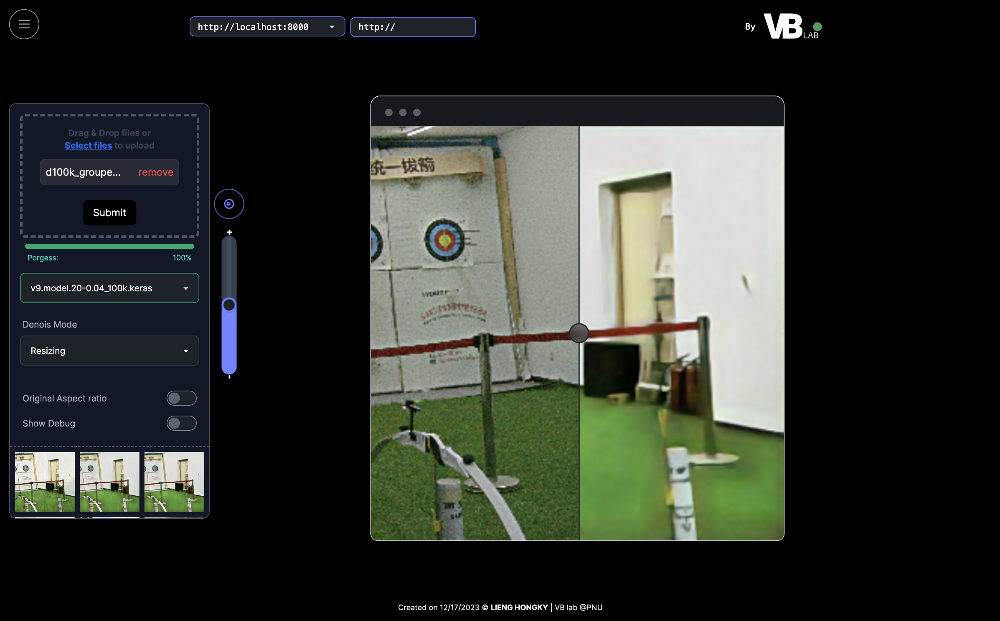
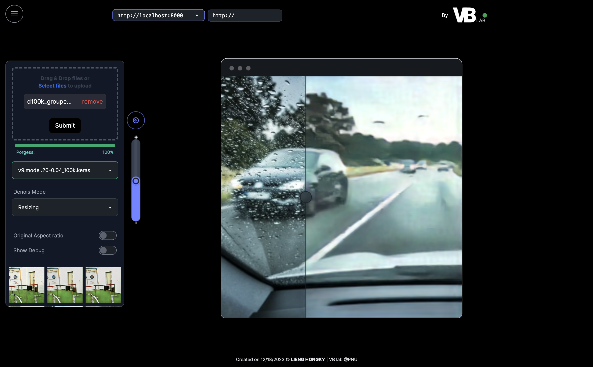
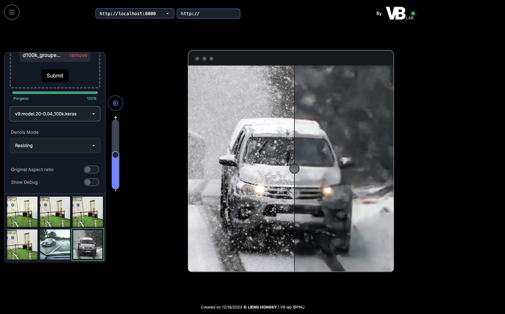

# PicyShake

### Demo: 
[https://lienghongky.github.io/PicyShake](https://lienghongky.github.io/PicyShake/)

## Start Application manually
### backend
`uvicorn main:app --host 0.0.0.0 --port 8000 --reload`
### frontend
`npm run dev`
## Using Docker
`docker-compose up -d`

